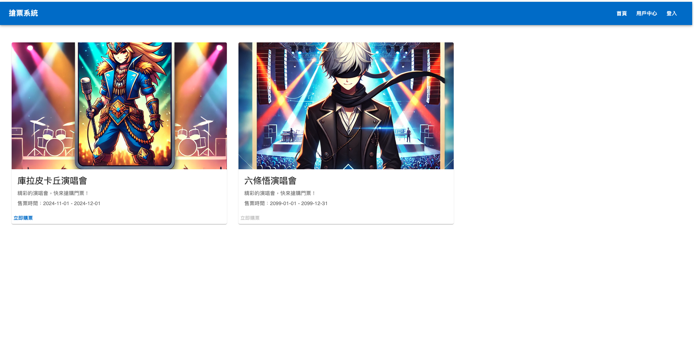
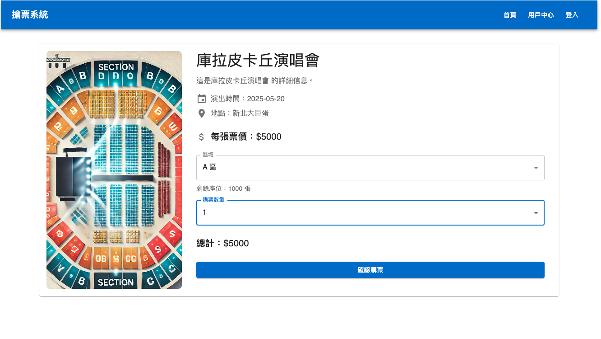
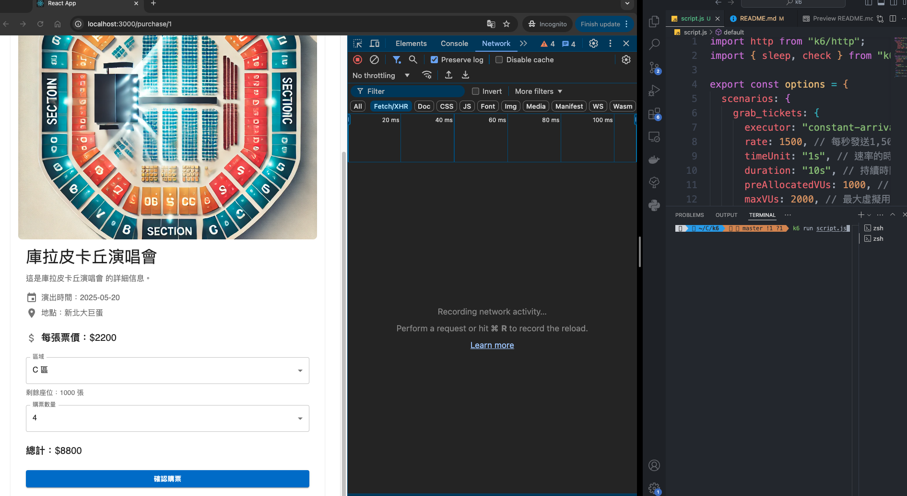
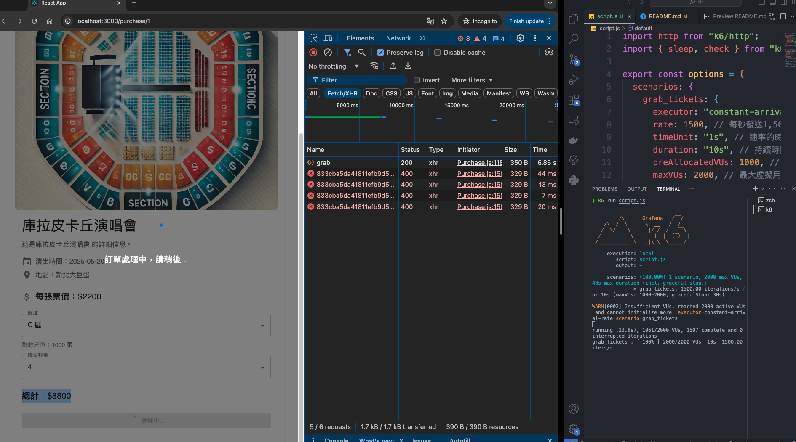
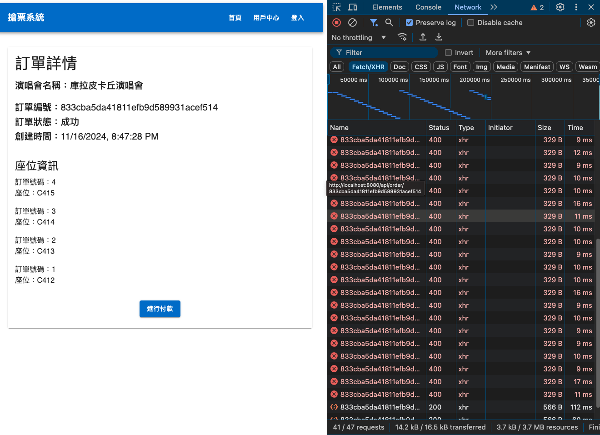

# 搶票系統前端專案

## 使用說明

本專案主要聚焦於搶票功能，登入及用戶中心頁面僅作為展示，無法使用。

## 系統需求

- Node.js 版本 18 以上
- 使用 npm 安裝依賴並啟動專案：

  ```bash
  npm install
  npm start
  ```

- .env 檔案配置：

  ```env
  REACT_APP_API_BASE_URL=http://localhost:8080/api
  ```

  請將上述路徑替換成後端 Gateway 的實際路徑。

### 進入購票頁面

1. 打開瀏覽器，輸入 [http://localhost:3000](http://localhost:3000) 進入首頁。
2. 點選「庫拉皮卡丘演唱會」的「立即購票」按鈕，進入購票頁面。

### 購票流程

1. 進入購票頁面後，選擇區域及票數。
2. 此時**先不要**按下「確認購票」。

### 壓力測試

1. 打開瀏覽器的開發者工具（按下 `F12`），觀察請求。

2. 打開壓力測試工具 **k6**，並執行腳本：

   ```bash
   k6 run script.js
   ```

   > **注意**：在使用 k6 之前，請先將專案 clone 下來：[https://github.com/samtash1034/Ticket-Graber-K6.git](https://github.com/samtash1034/Ticket-Graber-K6.git)

3. 執行腳本後，立即在購票頁面按下「確認購票」。

### 訂單處理

1. 若搶票成功，系統將進入訂單處理階段。此時前端每五秒鐘會向訂單 API 發送請求，以檢查訂單是否建立成功。
2. 一旦訂單建立成功，系統將自動跳轉到訂單頁面。
3. 訂單處理完成後，進入訂單頁面。**座位一定是連號的，確保使用者可以坐在一起。**

## 截圖展示

### 首頁



### 購票頁面



### 壓力測試中



### 訂單等待中



### 訂單成功


